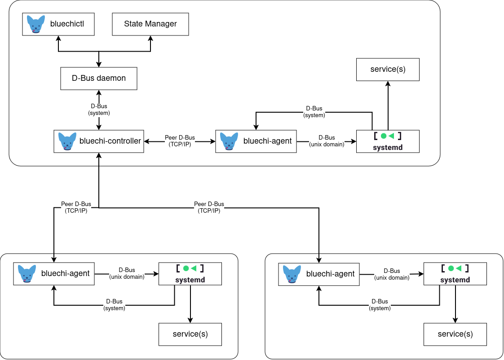

# BlueChi's Architecture

The image below depicts a generic overview of the BlueChi architecture:

Any application that wants to integrate with BlueChi does so via it's public D-Bus API on the local system bus. These
custom applications can be written in [a variety of languages](./api/examples.md).

One example of such an application shown in the diagram above is a state manager for the overall system. It can use
BlueChi's API to perform actions, receive their the outcome and/or monitor the state of services as well as the
connection state of managed nodes.

For administrators, `bluechictl` is the preferred interface sparing
administrators from interacting with BlueChi via D-Bus directly.
