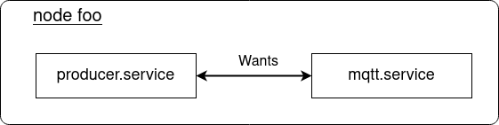

<!-- markdownlint-disable-file MD010 MD013 MD014 MD024 MD046 -->
# Cross-node Dependencies

Suppose within a system there is a systemd service collecting sensor data and providing it via an MQTT broker to other services. The `producer.service` would probably require a running broker where it publishes the data. The following diagram depicts such a system in a single node setup.



Using systemd services, this dependency on another, local service can be resolved by using keywords such as `Wants` or `Requires` in the unit definition of `producer.service`:

=== "producer.service"
    ```systemd
    [Unit]
    Wants=mqtt.service
    After=mqtt.service

    [Service]
    # ...
    ```

What if the `mqtt.service` is supposed to be running on a different node? Consider the following diagram:


By using only systemd mechanisms the declared dependency - `producer.service` on node foo requiring to have `mqtt.service` running on node bar - can't be resolved. In order to support these cross-node systemd unit dependencies, BlueChi introduces a new feature called [Proxy Services](./proxy_services.md).
