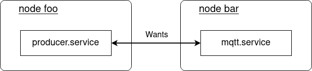

<!-- markdownlint-disable-file MD010 MD013 MD014 MD024 MD033 MD034 MD046 -->
# Proxy Services

The `bluechi-agent` component also includes two systemd template services, `bluechi-proxy@.service` and `bluechi-dep@.service`, which are the core of the proxy service mechanism to resolve cross-node dependencies. Consider the following example:



The `producer.service` depends on the `mqtt.service` running on a different node. In a single node setup, systemd unit mechanisms like `Wants` would be sufficient to define such a relationship. Based on BlueChi's proxy service feature the same systemd keywords can be used to express this dependency - with a small addition:

=== "producer.service (cross-node)"
    ```systemd
    [Unit]
    Wants=bluechi-proxy@bar_mqtt.service
    After=bluechi-proxy@bar_mqtt.service

    [Service]
    # ...
    ```

=== "producer.service (single node)"
    ```systemd
    [Unit]
    Wants=mqtt.service
    After=mqtt.service

    [Service]
    # ...
    ```

By using `Wants=`, the `bluechi-proxy@bar_mqtt.service` is started and send a request to BlueChi that initiates the process of starting `mqtt.service` (if needed) on node `bar`. When the requested `mqtt.service` becomes active (or it is detected it already was), the proxy service also becomes active.

If there is any problem activating the service, then the proxy service will fail to activate. With the `Wants=` options used in the example above this doesn't do anything, but you can use stronger dependencies like `Requires=`, which will make the activation of `need-db.service` not start if the dependency fails to start.

!!! Note

    For startup performance and robustness it is generally better to
    use weaker dependencies and handle failuress in other ways, like
    service restarts.

After a successful start, the `bluechi-proxy@bar_mqtt.service` will continue to be active as long as some other service depends on it or until the target service on the other node stops. When BlueChi detects that the target service becomes inactive, the proxy service will be stopped. This can be used with even stronger dependency options like `BindTo=` to cause the `producer.service` to stop when the `mqtt.service` stops.

In addition, when the last dependency of the proxy service on a node exits, the proxy service will stop, too. BlueChi will propagate this information to the target node `bar`. By default, in systemd this doesn't do anything, even if there are no other dependencies on the target service. However you can use `StopWhenUnneeded=yes` in the service to make it stop when the last dependency (local or via proxy) stops.

Based on the described example, the following diagram visualizes the architecture of the BlueChi proxy services:


## Limitations

BlueChi's proxy service feature only supports a subset of systemd's properties to define dependency relationships between units. In general, BlueChi's proxy services **do not** support `reverse properties` like `RequiredBy=`. Propagating a reload action to the required unit is currently **not supported** as well.

Based on systemd's mapping table for [properties to their inverses](https://www.freedesktop.org/software/systemd/man/latest/systemd.unit.html#Mapping%20of%20unit%20properties%20to%20their%20inverses), the following table shows which properties are supported:

<center>

| Property | Supported by BlueChi?  |
|---|:-:|
| `Before=`  | yes |
| `After=`  | yes |
| `Requires=`  | yes |
| `Wants=`  | yes |
| `Upholds=`  | yes |
| `PartOf=`  | no |
| `BindsTo=`  | yes |
| `Requisite=`  | yes |
| `Conflicts=`  | no |
| `PropagatesReloadTo=`  | no |
| `ReloadPropagatedFrom=`  | no |

</center>

## Internal Details on the source node

The proxy service is a template service called `bluechi-proxy@.service` of type `oneshoot` with `RemainAfterExit=yes`. This means that when it is started it will change into `activating` stage, and then start the `ExecStart` command. If this fails, it will go to `failed` state, but when it eventually succeeds it will go into `active` state (even though no process is running).

The `ExecStart` command starts the bluechi-proxy helper app that talks to the local agent, which in turn talks to the main bluechi service, starting the target service. Once it is running bluechi notifies the agent which in turns replies to the bluechi-proxy which then exits with the correct (failed or activated) exit status.

The proxy can be stopped on the local system (explicitly, or when the last dependency to is stops), which will trigger the `ExecPost` command, which tells the agent to unregister the proxy with bluechi, which in turn stops the dependency on the target service on the target node.

Alternatively, if bluechi notices that the target service stopped, after we returned successfully in the `ExecStart` command, then the agent explicitly stops the proxy service (via systemd).

## Internal Details on the target node

The bluechi agent also contains another template service called `bluechi-dep@.service` which is used on the target node. This service is templated on the target service name, such that whenever `bluechi-dep@XXX.service` it depends on `XXX.service` causing it to start. Whenever there is a proxy service running on some other node, bluechi starts a dep service like this to mirror it, which makes systemd consider the target needed.

The dependency used for the dep service is `BindsTo` and `After`, which is a very strong dependency. This means the state of the dep service mirrors the target service, i.e. stops when it stops. This is done to handle the case where the target service stops for some reason, and then there is a *new* proxy started. When this happens we will again start the dep service, but if it wasn't stopped with the target service it would already be running, and thus not trigger a re-start of the target service.

## Implementation Details

Tracking service state across multiple nodes is very tricky, as the state can diverge due to disconnects, delays, or races. To minimize such problems most state and intelligence is kept in the agent. Whenever the agent registers a new proxy it will announce this to the controller (if connected), and this will start a one-directional flow of non-interpreted state-change events from the target service to the controller to the agent, until the agent explicitly removes the proxy.

If an agent is disconnected from the controller, then the controller treats that as if the agent removed the proxy. On re-connection the agent will re-send the registering of the proxy.

In addition to the monitoring, each time a proxy is registered the controller will tell the target node to start the dep service for the target service. BlueChi keeps track of how many proxies are outstanding for the target service and only tell the agent to stop the dep service when this reaches zero. Similar to the above, when the target node reconnect we re-sent starts for any outstanding proxies.

!!! Note

    Due to disconnects we may sometimes send multiple start events to the target service, and we may report virtual "stop" events of the target when its really still active, only disconnected.
