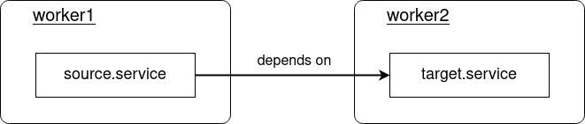

<!-- markdownlint-disable-file MD010 MD013 MD014 MD024 MD034 MD046 -->

# Using Proxy Services

This section describes different scenarios of cross-node dependencies between services, how to resolve them using BlueChi's proxy service feature and which systemd mechanisms to use for the desired behaviour. As a baseline, the term `source.service` will be used for the systemd service that depends on a remote service, which will be referred to as `target.service`.



!!! Note

    This section focuses on the systemd and BlueChi mechanisms to define dependencies enforcing certain behaviour. For an introduction to proxy services with an example application, please refer to the `Getting started guide` with the [cross-node dependency example](../getting_started/cross_node_dependencies.md).

## Stop source service when starting target service fails

If the `source.service` requires the `target.service` to be in an **active state** and otherwise stops, this can be ensured by using `Requires=`. The failure of `target.service` is simulated by just executing `/bin/false`, returning exit code 1.

=== "source.service"

````systemd
[Unit]
Requires=bluechi-proxy@worker2_target.service
After=bluechi-proxy@worker2_target.service

    [Service]
    Type=simple
    ExecStart=/bin/true
    RemainAfterExit=yes
    ```

=== "target.service"
```systemd
[Unit]
Description=Target service

    [Service]
    Type=simple
    ExecStart=/bin/false
    RemainAfterExit=yes
    ```

Let's try out the example services from above:

```bash
$ bluechictl start main source.service

$ bluechictl status main source.service
UNIT		| LOADED	| ACTIVE	| SUBSTATE	| FREEZERSTATE	| ENABLED	|
------------------------------------------------------------------------------------------------
source.service	| loaded	| inactive	| dead		| running	| static	|

$ bluechictl status worker1 target.service
UNIT		| LOADED	| ACTIVE	| SUBSTATE	| FREEZERSTATE	| ENABLED	|
------------------------------------------------------------------------------------------------
target.service	| loaded	| failed	| failed	| running	| static	|

````

!!! Note

    `Requires=` ensures that `source.service` stops when the `target.service` does. How to ensure that the `target.service` is restarted on exit is described [here](#restarting-the-target-service-on-failure).

## Stopping the target service when no longer needed

In order to automatically stop the `target.service` when the requiring `source.service` has been stopped, systemd's `StopWhenUnneeded=yes` can be used in the `[Unit]` section of the `target.service` as shown in the snippets below:

=== "source.service"

````systemd
[Unit]
Wants=bluechi-proxy@worker2_target.service
After=bluechi-proxy@worker2_target.service

    [Service]
    Type=simple
    ExecStart=/bin/true
    RemainAfterExit=yes
    ```

=== "target.service"
```systemd
[Unit]
StopWhenUnneeded=yes

    [Service]
    Type=simple
    ExecStart=/bin/true
    RemainAfterExit=yes
    ```

Let's try out the example services from above:

```bash
# start the source service and check status
$ bluechictl start worker1 source.service

$ bluechictl status worker1 source.service
UNIT			| LOADED	| ACTIVE	| SUBSTATE	| FREEZERSTATE	| ENABLED	|
---------------------------------------------------------------------------------
source.service	| loaded	| active	| exited	| running	    | static	|

$ bluechictl status worker2 target.service
UNIT			| LOADED	| ACTIVE	| SUBSTATE	| FREEZERSTATE	| ENABLED	|
---------------------------------------------------------------------------------
target.service	| loaded	| active	| exited	| running	    | static	|

# stop the source service and check status
$ bluechictl stop worker1 source.service

$ bluechictl status worker1 source.service
UNIT			| LOADED	| ACTIVE	| SUBSTATE	| FREEZERSTATE	| ENABLED	|
---------------------------------------------------------------------------------
source.service	| loaded	| inactive	| dead		| running	| static	    |

$ bluechictl status worker2 target.service
UNIT			| LOADED	| ACTIVE	| SUBSTATE	| FREEZERSTATE	| ENABLED	|
---------------------------------------------------------------------------------
target.service	| loaded	| inactive	| dead		| running	| static	    |
````

!!! Note

    In a system many services might depend on the same `target.service` and node. BlueChi keeps track of all those `source.service`s and will only stop the `target.service` when all requiring `source.service`s have been stopped.

## Restarting the target service on failure

If the `target.service` enters a **failed** or **inactive** state at some point in time, the `source.service` is able to restart it by using `Upholds=` as shown in the snippet below.

=== "source.service"

````systemd
[Unit]
Upholds=bluechi-proxy@worker2_target.service
After=bluechi-proxy@worker2_target.service

    [Service]
    Type=simple
    ExecStart=/bin/true
    RemainAfterExit=yes
    ```

=== "target.service"
```systemd
[Unit]
StopWhenUnneeded=yes

    [Service]
    Type=simple
    ExecStart=/bin/sleep 5
    ```

Let's try out the example services from above:

```bash
$ bluechictl start main source.service

$ bluechictl status main source.service
UNIT		    | LOADED	| ACTIVE	| SUBSTATE	| FREEZERSTATE	| ENABLED	|
---------------------------------------------------------------------------------
source.service	| loaded	| active	| exited	| running	    | static	|

$ bluechictl status worker2 target.service
UNIT		    | LOADED	| ACTIVE	    | SUBSTATE	| FREEZERSTATE	| ENABLED	|
-------------------------------------------------------------------------------------
target.service	| loaded	| active	    | running	| running	    | static	|
````

!!! Note

    Currently, `bluechictl` does not provide information on how long a systemd service has already been running. In order to view that `target.service` is continuously restarted, it is best to use `systemctl status target.service` on the worker2 node.
