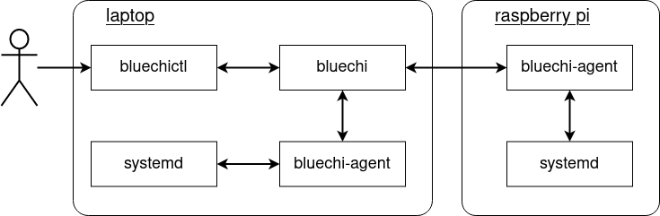
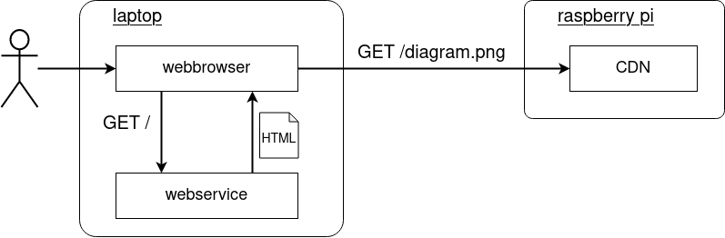

<!-- markdownlint-disable-file MD010 MD013 MD014 MD024 MD046 -->
# Getting started with BlueChi

On Fedora and CentOS-Stream systems (with [EPEL](https://docs.fedoraproject.org/en-US/epel/) repository enabled), all components of BlueChi can be directly installed via:

```bash
dnf install bluechi \
    bluechi-agent \
    bluechi-ctl \
    bluechi-selinux \
    python3-bluechi
```

!!! Note

    The command above installs BlueChi's core components - `bluechi` and `bluechi-agent` - as well as additional packages. `bluechi-ctl` is a CLI tool to interact with BlueChi's public D-Bus API provided by `bluechi` (controller). An SELinux policy is installed via the `bluechi-selinux` package. The last one supplies the [typed python bindings](./api/client_generation.md#typed-python-client), which simplifies programming custom applications that interact with BlueChi's API. 

## Setup: Single node

BlueChi's two core components - the controller and the agent - can run alongside each other on the same machine. A single node setup like this is one of the quickest way to get started. This section describes how to achieve that. The diagram below depicts the desired state of the system:


### Installation and configuration

First of all, lets install the controller and the agent as well as the CLI tool and the SELinux policy:

```bash
dnf install bluechi bluechi-agent bluechi-ctl bluechi-selinux 
```

Once the installation succeeded, `bluechi-controller` and `bluechi-agent` need to be configured. Both components use default settings so that a single node setup requires minimal configuration effort.

For the `bluechi-controller` configuration, the [AllowedNodeNames](./man/bluechi-controller-conf.md#allowednodenames-string) need to be adjusted in order to allow the `bluechi-agent` to register with its node name. By default, the agent will use the **hostname** it is running on.
BlueChi uses port **842** by default, which is considered a privileged port. To avoid any firewall issues for this demo, lets overwrite this setting and use the port **2020**.

Lets create a new configuration for `bluechi-controller` in its `conf.d` directory:

```bash
echo -e "[bluechi-controller]\nManagerPort=2020\nAllowedNodeNames=$(hostname)\n" > /etc/bluechi/controller.conf.d/1.conf
```

Since the default port has been changed, this setting has to be adjusted for the `bluechi-agent` as well:

```bash
echo -e "[bluechi-agent]\nManagerPort=2020\n" > /etc/bluechi/agent.conf.d/1.conf
```

After running both commands, the following files should have been created:

```bash
$ cat /etc/bluechi/controller.conf.d/1.conf

[bluechi-controller]
ManagerPort=2020
AllowedNodeNames=<hostname>

$ cat /etc/bluechi/agent.conf.d/1.conf

[bluechi-controller]
ManagerPort=2020
```

!!! Note

    For a full list of available configuration options, please refer to [bluechi(5)](./man/bluechi-controller-conf.md) and [bluechi-agent(5)](./man/bluechi-agent-conf.md). 

### Running BlueChi

After [installation and configuration](#installation-and-configuration) has been completed, both applications can be started as systemd services:

```bash
systemctl start bluechi-controller bluechi-agent
```

Once the services are up and running, the journald logs should show that the agent successfully connected to the controller:

```bash
$ journalctl -u bluechi

Sep 14 14:51:58 laptop systemd[1]: Started BlueChi systemd service controller manager daemon.
Sep 01 14:51:58 laptop bluechi[3750775]: 2023-09-14 14:51:58,685+0200 INFO        ../src/manager/manager.c:924 manager_start        msg="Starting bluechi 0.5.0"
Sep 01 14:51:58 laptop bluechi[3750775]: 2023-09-14 14:51:58,928+0200 INFO        ../src/manager/node.c:870 node_method_register    msg="Registered managed node from fd 8 as 'laptop'"
...
```

Lets use `bluechictl` to list all units on the machine:

```bash
$ bluechictl list-units

NODE            	|ID                                                     	|   ACTIVE|  	SUB
====================================================================================================
laptop          	|time-sync.target                                       	| inactive| 	dead
laptop          	|nfs-idmapd.service                                     	| inactive| 	dead
laptop          	|sys-devices-platform-serial8250-tty-ttyS5.device       	|   active|  plugged
laptop          	|dev-disk-by\x2did-wwn\x2d0x5001b448b9db9490\x2dpart3.device|   active|  plugged
laptop          	|podman.socket                                          	|   active|listening
....
```

The setup works!

For more examples on how to use BlueChi, please see refer to the [examples section](#examples-on-how-to-use-bluechi).

!!! Note

    For a full list of available commands of `bluechictl`, please refer to [bluechictl(1)](./man/bluechictl.md).

## Setup: Multi node

BlueChi is intended for multi-node environments with a predefined number of nodes. This section describes how to set it up based on an example with two machines - a laptop and a raspberry pi. The diagram below depicts the desired state of the system:



### Installation and configuration

The main node will be the **laptop**. So first of all, lets install the controller, the agent and the CLI tool as well as the SELinux policy on it:

```bash
dnf install bluechi bluechi-agent bluechi-ctl bluechi-selinux 
```

The **raspberry pi** will be (one of) the managed node in this example. Therefore, only install the agent and the SELinux policy on it:

```bash
dnf install bluechi-agent bluechi-selinux 
```

Once the installations succeeded, BlueChi needs to be configured on both machines.

#### Configuring the main node

Lets start with the main node (the **laptop** in this case). The configuration of the controller running on the **laptop** is similar to the [single node setup](#installation-and-configuration) with the exception of adding **pi** as another node to it:

```bash
echo -e "[bluechi-controller]\nManagerPort=2020\nAllowedNodeNames=$(hostname),pi\n" > /etc/bluechi/controller.conf.d/1.conf
```

Lets also create the configuration for the agent on the **laptop** changing the port:

```bash
echo -e "[bluechi-agent]\nManagerPort=2020\n" > /etc/bluechi/agent.conf.d/1.conf
```

#### Configuring the managed node

In the next step the managed node (the **raspberry pi** in this case) needs to be configured. The managed node needs to know where to connect to, so the settings for the [ManagerHost](./man/bluechi-agent-conf.md#managerhost-string) as well as the [ManagerPort](./man/bluechi-agent-conf.md#managerport-uint16_t) have to be set to the IP and Port of the main node. In addition, the [NodeName](./man/bluechi-agent-conf.md#nodename-string) has to be set to **pi** (as set in the **AllowedNodeNames** in the [previous section](#configuring-the-main-node)).

Assuming the main nodes IP within the network is `192.168.42.10`, the configuration file for the agent on the **raspberry pi** can be created like this:

```bash
echo -e "[bluechi-agent]\nManagerHost=192.168.42.10\nManagerPort=2020\n" > /etc/bluechi/agent.conf.d/1.conf
```

The content of the new file should be:

```bash
$ cat /etc/bluechi/agent.conf.d/1.conf

[bluechi-controller]
ManagerHost=192.168.42.10
ManagerPort=2020
```

### Running BlueChi

After [installation and configuration](#installation-and-configuration-1) has been completed, lets start the systemd services.

Starting the controller and agent on the main node (**laptop**):

```bash
systemctl start bluechi-controller bluechi-agent
```

Switching to the managed node (**raspberry pi**), start the agent:

```bash
systemctl start bluechi-agent
```

Once the services are up and running, the journald logs on the **laptop** should show that the both agents have successfully connected to the controller:

```bash
$ journalctl -u bluechi-controller

Sep 14 14:51:58 laptop systemd[1]: Started BlueChi systemd service controller manager daemon.
Sep 01 14:51:58 laptop bluechi[3750775]: 2023-09-14 14:51:58,685+0200 INFO        ../src/manager/manager.c:924 manager_start        msg="Starting bluechi 0.5.0"
Sep 01 14:51:58 laptop bluechi[3750775]: 2023-09-14 14:51:58,928+0200 INFO        ../src/manager/node.c:870 node_method_register    msg="Registered managed node from fd 8 as 'laptop'"
Sep 01 14:52:02 laptop bluechi[3750775]: 2023-09-14 14:52:02,534+0200 INFO        ../src/manager/node.c:870 node_method_register    msg="Registered managed node from fd 9 as 'pi'"
...
```

Lets use `bluechictl` on the main node to list all units:

```bash
# list all units on the laptop
$ bluechictl list-units laptop

NODE            	|ID                                                     	|   ACTIVE|  	SUB
====================================================================================================
laptop          	|time-sync.target                                       	| inactive| 	dead
laptop          	|nfs-idmapd.service                                     	| inactive| 	dead
laptop          	|sys-devices-platform-serial8250-tty-ttyS5.device       	|   active|  plugged
laptop          	|dev-disk-by\x2did-wwn\x2d0x5001b448b9db9490\x2dpart3.device|   active|  plugged
laptop          	|podman.socket                                          	|   active|listening
...

# list all units on the raspberry pi
$ bluechictl list-units pi

NODE            	|ID                                                     	|   ACTIVE|  	SUB
====================================================================================================
pi                  |acpid.path                                                 |   active|  running
pi                  |system-systemd\x2dcryptsetup.slice                         |   active|   active
pi                  |nfs-kernel-server.service                                  | inactive|     dead
pi                  |dev-ttyS24.device                                          |   active|  plugged
pi                  |dbus.service                                               |   active|  running
...
```

The setup works!

For more examples on how to use BlueChi, please see refer to the [examples section](#examples-on-how-to-use-bluechi).

!!! Note

    For a full list of available commands of `bluechictl`, please refer to [bluechictl(1)](./man/bluechictl.md).

## Examples on how to use BlueChi

For the examples in this section the a [multi-node setup](#setup-multi-node) is assumed to be running and uses [bluechictl](./man/bluechictl.md) to interact with BlueChi. In order to leverage the full potential of BlueChi, e.g. by writing custom applications, please refer to the section describing how to [use BlueChi's D-Bus API](./api/examples.md).

### Getting information of units

The `bluechictl list-units` command can be used to get a list of all units and their states on either all or the specified node. It also provides a filter option for the unit name:

```bash
$ bluechictl list-units --filter=bluechi*

NODE                |ID                                                         |   ACTIVE|      SUB
====================================================================================================
laptop              |bluechi-controller.service                                 |   active|  running
laptop              |bluechi-agent.service                                      |   active|  running
pi                  |bluechi-agent.service                                      |   active|  running
```

### Monitoring of units and nodes

The `bluechictl monitor <node-name> <unit-name>` command enables to view changes in real-time. For example, to monitor all state changes of `cow.service` on `pi` the following command can be issued:

```bash
$ bluechictl monitor pi cow.service
```

`bluechictl monitor` also supports the wildcard character `*` for both, `<node-name>` and `<unit-name>`.

```bash
$ bluechictl monitor \* \*

Monitor path: /org/eclipse/bluechi/monitor/1
Subscribing to node '*' and unit '*'
[laptop] *
	Unit created (reason: virtual)
[pi] *
	Unit created (reason: virtual)
...
```

!!! Note

    When a unit subscription with a wildcard `*` exists, BlueChi emits `virtual` events for the unit with name `*` on
    
    - creation of the wildcard subscription
    - node in the the wildcard subscription dis-/connects

    This enables an observer to do the necessary re-queries since state changes could have happened while the node was disconnected.

In addition to monitoring units, BlueChi's APIs can be used to query and monitor the node connection states:

```bash
$ bluechictl monitor node-connection

NODE                          | STATE     | LAST SEEN                   
=========================================================================
laptop                        | online    | now                         
pi                            | online    | now                         
```

Assuming node `pi` would go offline, the output would immediately change to something like this:

```bash
NODE                          | STATE     | LAST SEEN                   
=========================================================================
laptop                        | online    | now                         
pi                            | online    | 2023-10-06 08:38:20,000+0200                         
```

### Operations on units

The `bluechictl start` command can be used to start systemd units on managed nodes:

```bash
$ bluechictl start pi httpd

Done
```

!!! Note

    Starting a systemd unit via BlueChi's D-Bus API queues a job to start that unit in systemd. `bluechictl start` also waits for this job to be completed. This also applies to other operations like **stop**. 

Lets stop the `httpd` service:

```bash
$ bluechictl stop pi httpd

Done
```

Assuming the new systemd unit **cow.service** has been created on the managed node **pi**, systemd requires a daemon reload to use it. This can also be triggered via `bluechictl`:

```bash
$ bluechictl daemon-reload pi
$ bluechictl start pi cow.service

Done
```

If it is required to enable/disable the **cow.service**, this can easily be done via:

```bash
$ bluechictl enable pi cow.service
$ bluechictl disable pi cow.service
```

If it is required to temporarily prevent the **cow.service** to get any CPU time, this can be done via a `freeze` command:

```bash
$ bluechictl freeze pi cow.service

# revert the previous freeze
$ bluechictl thaw pi cow.service
```

### Resolving cross-node dependencies

In practice, it is a common scenario that a service running on Node A requires another service to run on Node B. Consider the following example:



The overall service consists of two applications - a webservice rendering an HTML and a CDN providing assets such as images.

The following sections will provide a simplistic implementation of this example. In addition, it is assumed that a running CDN service on the raspberry pi is required by the webservice on the laptop. This cross-node dependency is then resolved by employing BlueChi's proxy service feature - so starting the webservice will also start the CDN.

!!! Note

    A detailed explanation of how Proxy Services are implemented in BlueChi based on systemd can be found [here](./proxy_services.md).

#### Setting up the CDN

On the raspberry pi, first create a temporary directory and add an example image to it:

```bash
mkdir -p /tmp/bluechi-cdn
cd /tmp/bluechi-cdn
wget https://raw.githubusercontent.com/containers/bluechi/main/doc/docs/img/bluechi_architecture.jpg
```

For the sake of simplicity, python's [http.server module](https://docs.python.org/3/library/http.server.html) is used to simulate a CDN. Create a new file `/etc/systemd/system/bluechi-cdn.service` and paste the following systemd unit definition:

```systemd
[Unit]
Description=BlueChi's CDN from the cross-node dependency example

[Service]
Type=simple
ExecStart=/usr/bin/python3 -m http.server 9000 --directory /tmp/bluechi-cdn/
```

Reload the systemd manager configuration so it can find the newly created service:

```bash
$ systemctl daemon-reload
```

Lets verify that the service works as expected. First, start the service via:

```bash
$ systemctl start bluechi-cdn.service
```

Then submit a query to it. The response should be an HTML page that contains the previously added image as a list item:

```html
$ curl localhost:9000

<!DOCTYPE HTML PUBLIC "-//W3C//DTD HTML 4.01//EN" "http://www.w3.org/TR/html4/strict.dtd">
<html>
<head>
<meta http-equiv="Content-Type" content="text/html; charset=utf-8">
<title>Directory listing for /</title>
</head>
<body>
<h1>Directory listing for /</h1>
<hr>
<ul>
<li><a href="bluechi_architecture.jpg">bluechi_architecture.jpg</a></li>
</ul>
<hr>
</body>
</html>
```

Finally, stop the service again:

```bash
$ systemctl stop bluechi-cdn.service
```

#### Setting up the WebService

On the laptop, also create a temporary directory as well as an empty python file:

```bash
mkdir -p /tmp/bluechi-webservice
cd /tmp/bluechi-webservice
touch service.py
```

The following code is a rudimentary implementation of the webservice which should be able to run without any other dependencies. On any request, it will return a small HTML string containing a link to the image in the CDN. Copy and paste it into the previously created `service.py`.

```python
import sys
import wsgiref.simple_server

port: int = None
cdn_host: str = None

def service(environ, start_response):
    status = "200 OK"
    headers = [("Content-Type", "text/html")]

    response = f"""
<html>
    <body>
        
    </body>
</html>
    """

    start_response(status, headers)
    return [response.encode("utf-8")]

if __name__ == "__main__":
    if len(sys.argv) != 3:
        print("Usage: python3 webservice.py <port> <cdn-host>")
        exit(1)

    port = int(sys.argv[1])
    cdn_host = sys.argv[2]

    server = wsgiref.simple_server.make_server(
        host="localhost", 
        port=port,
        app=service
    )

    while True:
        server.handle_request()
```

Lets create a new systemd unit to wrap the `service.py`. Copy and paste the following unit definition into `/etc/systemd/system/bluechi-webservice.service`:

```systemd
[Unit]
Description=BlueChi's webservice from the cross-node dependency example

[Service]
Type=simple
ExecStart=/usr/bin/python3 /tmp/bluechi-webservice/service.py 9000 192.168.178.55:9000
```

!!! Note

    Make sure to replace the IP address `192.168.178.55` with the corresponding one of the raspberry pi in your setup.

Start the service via `systemctl` to verify it works as expected:

```html
$ systemctl start bluechi-webservice.service
$ curl localhost:9000

<html>
    <body>
        
    </body>
</html>
```

Make sure to stop the service again before proceeding:

```bash
$ systemctl stop bluechi-webservice.service
```

#### Resolving the dependency via BlueChi

After implementing both applications, lets ensure that starting the webservice will also start the CDN. Add the following lines to `bluechi-webservice.service` in the `[Unit]` section:

```systemd
Wants=bluechi-proxy@pi_bluechi-cdn.service
After=bluechi-proxy@pi_bluechi-cdn.service
```

`bluechi-proxy@.service` is a [systemd service template](https://www.freedesktop.org/software/systemd/man/systemd.service.html#Service%20Templates) provided by BlueChi that enables resolving cross-node dependencies. The argument between the `@` symbol and the `.service` postfix follows the pattern `bluechi-proxy@<node>_<service>.service`. BlueChi will split the argument accordingly and start the specified `<service>` on the `<node>`. In the case above, it will start `bluchi-cdn.service` on the node `pi`.

The systemd unit mechanism [Wants](https://www.freedesktop.org/software/systemd/man/systemd.unit.html#Wants=) is used for declaring that dependency and starting it (if not already running). In addition, the [After](https://www.freedesktop.org/software/systemd/man/systemd.unit.html#Before=) setting is used to ensure that the webservice starts only after the CDN has been started.

The final `bluechi-webservice.service` should look like this:

```bash
$ cat /etc/systemd/system/bluechi-webservice.service

[Unit]
Description=BlueChi's webservice from the cross-node dependency example
Wants=bluechi-proxy@pi_bluechi-cdn.service
After=bluechi-proxy@pi_bluechi-cdn.service

[Service]
Type=simple
ExecStart=/usr/bin/python3 /tmp/bluechi-webservice/service.py 9000 192.168.178.55:9000
```

Since the dependency is encoded into the systemd unit, the webservice can be started either via `bluechictl` or `systemctl`:

```bash
bluechictl start laptop bluechi-webservice.service
# or use
systemctl start bluechi-webservice.service
```

On the laptop - where `bluechi-controller` is running - use `bluechictl` to verify that both services are running now:

```bash
$ bluechictl status laptop bluechi-webservice.service

UNIT                            | LOADED        | ACTIVE        | SUBSTATE      | FREEZERSTATE  | ENABLED       |
----------------------------------------------------------------------------------------------------------------
bluechi-webservice.service      | loaded        | active        | running       | running       | static        |

$ bluechictl status pi bluechi-cdn.service

UNIT                    | LOADED        | ACTIVE        | SUBSTATE      | FREEZERSTATE  | ENABLED       |
--------------------------------------------------------------------------------------------------------
bluechi-cdn.service     | loaded        | active        | running       | running       | static        |
```

Use a webbrowser on the laptop and navigate to `localhost:9000`. The resulting page is served by the `bluechi-webservice.service` (laptop) and it displays the image fetched from the `bluechi-cdn.service` (raspberry pi).
