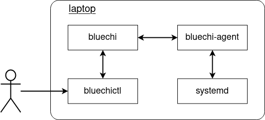

<!-- markdownlint-disable-file MD010 MD013 MD014 MD024 MD046 -->

# Setup: Single node

BlueChi's two core components - the controller and the agent - can run alongside each other on the same machine. A single node setup like this is one of the quickest way to get started. This section describes how to achieve that. The diagram below depicts the desired state of the system:



## Installation and configuration

First of all, let's install the controller and the agent as well as the CLI tool and the SELinux policy:

```bash
dnf install bluechi bluechi-agent bluechi-ctl bluechi-selinux
```

Once the installation succeeded, `bluechi-controller` and `bluechi-agent` need to be configured. Both components use default settings so that a single node setup requires minimal configuration effort.

For the `bluechi-controller` configuration, the [AllowedNodeNames](../man/bluechi-controller-conf.md#allowednodenames-string) need to be adjusted in order to allow the `bluechi-agent` to register with its node name. By default, the `bluechi-controller` will listen on Unix Domain Socket (UDS) `/run/bluechi/bluechi.sock` for local agents and on the TCP port **842** for remote ones. Since this is a single node setup, let's use the Unix Domain Socket as transport mechanism.

First, create a new configuration for `bluechi-controller` in its `conf.d` directory:

```bash
echo -e "[bluechi-controller]\nAllowedNodeNames=$(hostname)\n" > /etc/bluechi/controller.conf.d/1.conf
```

The default connection mechanism of the `bluechi-agent` is TCP/IP. Therefore, its configuration needs to be adjusted as well:

```bash
echo -e "[bluechi-agent]\nControllerAddress=unix:path=/run/bluechi/bluechi.sock\n" > /etc/bluechi/agent.conf.d/1.conf
```

After running both commands, the following files should have been created:

```bash
$ cat /etc/bluechi/controller.conf.d/1.conf

[bluechi-controller]
AllowedNodeNames=<hostname>

$ cat /etc/bluechi/agent.conf.d/1.conf

[bluechi-agent]
ControllerAddress=unix:path=/run/bluechi/bluechi.sock
```

!!! Note

    For a full list of available configuration options, please refer to [bluechi(5)](../man/bluechi-controller-conf.md) and [bluechi-agent(5)](../man/bluechi-agent-conf.md).

## Running BlueChi

After [installation and configuration](#installation-and-configuration) has been completed, both applications can be started as systemd services:

```bash
systemctl start bluechi-controller bluechi-agent
```

Once the services are up and running, the journald logs should show that the agent successfully connected to the controller:

```bash
$ journalctl -u bluechi-controller
Dec 18 08:03:03 localhost systemd[1]: Started BlueChi Controller systemd service
Dec 18 08:03:03 localhost bluechi-controller[680]: Starting bluechi-controller 0.10.0-0
Dec 17 16:13:43 localhost bluechi-controller[2539]: Waiting for connection requests on port 842...
Dec 17 16:13:43 localhost bluechi-controller[2539]: Waiting for connection requests on socket /run/bluechi/bluechi.sock...
Dec 18 08:03:03 localhost bluechi-controller[680]: Heartbeat disabled since configured interval '0' is <=0
Dec 18 08:03:03 localhost bluechi-controller[680]: Registered managed node from fd 10 as 'local'
...
```

Let's use `bluechictl` to list all units on the machine:

```bash
$ bluechictl list-units

NODE            	|ID                                                     	|   ACTIVE|  	SUB
====================================================================================================
laptop          	|time-sync.target                                       	| inactive| 	dead
laptop          	|nfs-idmapd.service                                     	| inactive| 	dead
laptop          	|sys-devices-platform-serial8250-tty-ttyS5.device       	|   active|  plugged
laptop          	|dev-disk-by\x2did-wwn\x2d0x5001b448b9db9490\x2dpart3.device|   active|  plugged
laptop          	|podman.socket                                          	|   active|listening
....
```

The setup works!

For more examples on how to use BlueChi, please see refer to the [examples section](./examples_bluechictl.md).

!!! Note

    For a full list of available commands of `bluechictl`, please refer to [bluechictl(1)](../man/bluechictl.md).
