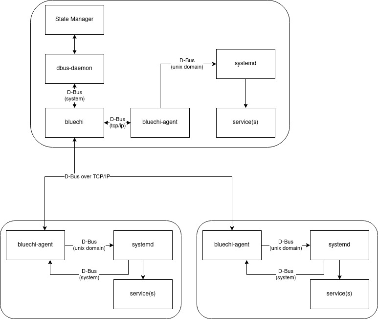

# BlueChi

## What is BlueChi?

BlueChi (formerly known as hirte) is a deterministic multi-node service manager

BlueChi can manage the states of different services across multiple nodes with a
focus on highly regulated industries, such as those requiring function safety.
BlueChi integrates with systemd via its D-Bus API and relays D-Bus messages over
TCP for multi-nodes support.

On the main node a service called `bluechi-controller` is running. On startup, the manager
loads the configuration files which describe all the involved systems
(called nodes) that are expected to be managed. Each node has a
unique name that is used to reference it in the manager.

On each managed node that is under control of BlueChi a service called `bluechi-agent`
is running. When the service starts, it connects (via D-Bus over TCP) to the manager
and registers as available (optionally authenticating). It then receives requests
from the manager and reports local state changes to it.

## Background

BlueChi is built around three components:

* bluechi service, running on the primary node, is the primary orchestrator
* bluechi-agent services, with one running on each managed node, is the agent
  talking locally to systemd to act on services
* bluechictl command line program, is meant to be used by administrators to test,
  debug, or manually manage services across nodes.

BlueChi is meant to be used in conjunction with a state manager (a program or
person) knowing the desired state of the system(s). This design choice has a few
consequences: a) bluechi itself does not know the desired final state of the
system(s), it only knows how to transition between states, i.e.: how to start,
stop, restart a service on one or more nodes. b) bluechi monitors and reports
changes in services running, so that the state manager is notified when a
service stops running or when the connection to a node is lost, but bluechi itself
does not act on these notifications. c) bluechi does not handle the “initial
setup” of the system, it is assumed that the system boots in a desired state and
bluechi handles the transitions from this state.

The state manager program integrates with bluechi over D-Bus. The state manager
asks bluechi to perform actions or to receive the outcome of actions. BlueChi
reports state changes back to the state manager when monitoring services and
nodes via D-Bus. For administrators, bluechictl is the preferred interface sparing
administrators from interacting with bluechi via D-Bus directly.

## Overview

Here is a generic overview of the BlueChi architecture:

