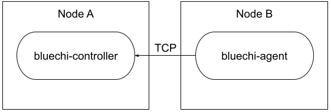

# Securing BlueChi connections with mTLS and double proxy

BlueChi utilizes TCP based controller-client communication between the machines.
Since BlueChi manages systemd units, it uses the D-Bus protocol and the sd-bus API,
not only between bluechi-agent and systemd, but also between bluechi-controller and bluechi-agent.

The problem is that D-Bus mainly targets local inter-process communication on top of Unix sockets
and therefore does not natively support encryption or authentication.
One possible solution is to use SSH. However, SSH between nodes is too large of a tunnel.

## The double proxy approach

The double proxy approach uses two proxies — forward and reverse — between the two communicating parties.
This approach has several advantages when it comes to service discovery and,
more relevant to our case, the off-loading of mTLS.

In its simplest form, bluechi-agent connects to the bluechi-controller’s port directly over TCP.



With the double proxy approach, instances of bluechi-agent connect to a local forward proxy over a Unix socket.
The forward proxy connects over TCP to the remote reverse proxy for mTLS.
Finally, the reverse proxy connects to bluechi-controller locally over a Unix socket.


NOTE: The bluechi-controller and bluechi-agent are not aware of the existence of the proxies.
They just listen (bluechi-controller) and connect (bluechi-agent) to a local Unix socket.

## Step by step Guide

This guide uses HAProxy for both proxies, but other implementations can be used, such as envoy proxy.

### All machines

#### Enable EPEL

Enable [EPEL](https://docs.fedoraproject.org/en-US/epel/) in order to install BlueChi

#### Installation

Install HAProxy:

```bash
dnf install haproxy
```

#### General Configuration

Make sure the HAProxy configuration file `/etc/haproxy/haproxy.cfg`
does not contain any unwanted servers - frontend or backend

#### SELinux

When running on an SELinux enforcing system, the communication port must be allowed on all machines.

Make sure to install `policycoreutils-python-utils`

```bash
dnf install policycoreutils-python-utils
```

In this demo, the communication port is 2021:

```bash
semanage port -a -t http_port_t -p tcp 2021
```

#### SSL certificates

Each node should have its own SSL key and certificate.
By default, HAProxy confines itself to `/var/lib/haproxy`, therefore all files must be stored inside this path.
The demo uses a self-signed certificate authority (CA) certificate, so three files were used:
ca-certificate.pem, cert.key and cert.

#### Disable default HAProxy server

Edit the default configuration file `/etc/haproxy/haproxy.cfg` and comment out the `frontend` main

#### Enable and start HAProxy

HAProxy supports reloading. So, it can be started before it is actually configured:

```bash
systemctl enable --now haproxy.service
```

### bluechi-controller machine

#### bluechi-controller

Install bluechi-controller along with bluechictl:

```bash
dnf install bluechi-controller bluechi-ctl
```

BlueChi supports systemd socket activation, so only the `AllowedNodeNames` should be set

Add the file: `/etc/bluechi/controller.conf.d/allowed_list.conf`:

```ini
[bluechi-controller]
AllowedNodeNames=<List the node names>
```

In addition, update the `bluechi.socket` unit by editing `/usr/lib/systemd/system/bluechi-controller.socket`:

```ini
[Socket]
ListenStream=/var/lib/haproxy/bluechi-controller.sock

[Install]
WantedBy=multi-user.target
```

NOTE: By default, HAProxy confines itself to `/var/lib/haproxy`.
Therefore, the socket must be created in this directory.

Enable and start the bluechi.socket unit:

```bash
systemctl enable --now bluechi-controller.socket
```

#### HAProxy as a reverse proxy

Configure HAProxy to listen on port 2021 and enforce mTLS using the certificates.
All traffic is forwarded to bluechi-controller via its Unix socket.

```haproxy
#---------------------------------------------------------------------
# main frontend which proxys to the backends
#---------------------------------------------------------------------
frontend bluechi-controller
    mode tcp
    bind *:2021 ssl crt /var/lib/haproxy/cert verify required ca-file /var/lib/haproxy/ca-certificate.pem
    default_backend bluechi-controller

#---------------------------------------------------------------------
# round robin balancing between the various backends
#---------------------------------------------------------------------
backend bluechi-controller
    mode tcp
    balance     roundrobin
    server  bluechi-controller /bluechi-controller.sock
```

Store the configuration in `/etc/haproxy/conf.d/bluechi-controller.cfg` and reload HAProxy:

```bash
systemctl reload haproxy.service
```

### bluechi-agent machine

#### HAProxy as a forward proxy

Configure HAProxy to listen on a local Unix socket.
All traffic is forwarded to the remote machine while enforcing mTLS.

```haproxy
#----------------------------------------------------------------
# main frontend which proxys to the backends
#----------------------------------------------------------------
frontend bluechi-agent
    mode tcp
    bind /var/lib/haproxy/bluechi-agent.sock
    default_backend bluechi-agent

#----------------------------------------------------------------
# round robin balancing between the various backends
#----------------------------------------------------------------
backend bluechi-agent
    mode tcp
    balance     roundrobin
    server  bluechi-agent < BLUECHI_CONTROLLER_ADDRESS >:2021 ssl crt /var/lib/haproxy/cert verify required ca-file /var/lib/haproxy/ca-certificate.pem
```

Store the configuration in `/etc/haproxy/conf.d/bluechi-agent.cfg` and reload HAProxy:

```bash
systemctl reload haproxy.service
```

#### bluechi-agent

Install the bluechi-agent:

```bash
dnf install bluechi-agent
```

Configure bluechi-agent to connect to bluechi-controller using the local Unix socket
using the drop-in file `/etc/bluechi/agent.conf.d/local_socket.conf`

```ini
[bluechi-agent]
NodeName=< NODE_NAME >
ControllerAddress=unix:path=/var/lib/haproxy/bluechi-agent.sock
```

Enable and start bluechi-agent:

```bash
systemctl enable --now bluechi-agent.service
```

### Verify the connection

There are three main ways to verify that bluechi-agent connected to bluechi-controller.

#### bluechi-agent logs

On the bluechi-agent machine, review the bluechi-agent journal logs:

```bash
journalctl -u bluechi-agent.service

Oct 31 08:53:46 bluechi systemd[1]: Started BlueChi systemd service agent daemon.
Oct 31 08:53:46 bluechi bluechi-agent[16279]: Starting bluechi-agent 0.7.0
Oct 31 08:53:46 bluechi bluechi-agent[16279]: Connecting to controller on unix:path=/var/lib/haproxy/bluechi-agent.sock
Oct 31 08:53:46 bluechi bluechi-agent[16279]: Connected to controller as 'self'
```

#### bluechi-controller logs

On the bluechi-controller machine, review the bluechi journal logs:

```bash
journalctl -u bluechi-controller.service

Oct 31 08:53:46 bluechi systemd[1]: Started BlueChi Controller systemd service.
Oct 31 08:53:46 bluechi bluechi-controller[16280]: Starting bluechi 0.7.0
Oct 31 08:53:46 bluechi bluechi-controller[16280]: Registered managed node from fd 9 as 'self'
```

#### bluechictl

BlueChi provides a command-line tool that communicates with bluechi-controller.
From the bluechi-controller machine, run bluechictl to list the systemd units on all machines:

```bash
$ bluechictl list-units

ODE                |ID                                                         |   ACTIVE|      SUB
====================================================================================================
self                |haproxy.service                                            |   active|  running
self                |systemd-ask-password-wall.path                             |   active|  waiting

...
remote              |systemd-modules-load.service                               | inactive|     dead
remote              |initrd-cleanup.service                                     | inactive|     dead
Summary
```

## Summary

BlueChi leverages the DBus protocol that does not natively support encryption.
Although SSH can be used for this purpose,
using a double proxy approach for mTLS allows you to limit the tunnel between the nodes to the specific use case.

Other implementations that leverage the DBus protocol can use the same mechanism to secure their connections.

For more information about the deployment see the instructions in the git repository.
