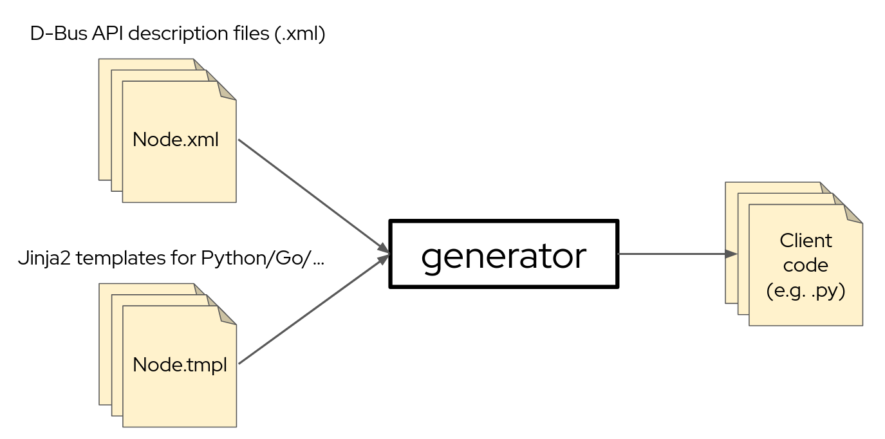

# D-Bus API client generator

The D-Bus API client generator uses the XML specification for D-Bus interfaces (see
[DTD describing it](http://www.freedesktop.org/standards/dbus/1.0/introspect.dtd)), extracts the contained information
and passes a data dictionary to Jinja2 for rendering.



## Usage

First install the required packages via:

```bash
pip install -r requirements.txt
```

Then the generator can be called with the following parameters:

```bash
# data-dir: Directory containing the D-Bus API description (.xml) files
# template-dir: Directory containing the Jinja2 templates
# output-file-path: Path (incl. file name) for the output
python generator.py <data-dir> <template-dir> <output-file-path>
```

The `template-dir` needs to contain a `api.tmpl` file, which will be used by the generator as a "root file" - including
all other templates if necessary.
